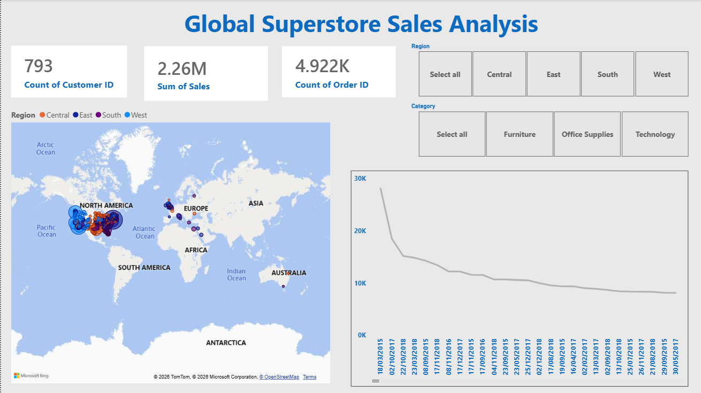
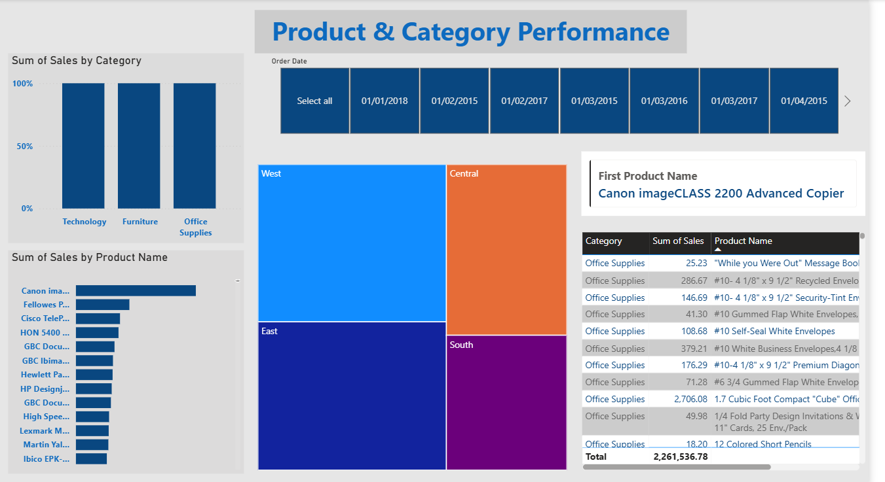

# Project Name / Power BI Technical Report

## Overview
This repository contains structural configurations, layouts, and data models for a Business Intelligence / Reporting solution. It includes visual schemas, security settings, and theme definitions designed to deliver standardized analytics and reporting.

## Insights :
### Sales Analysis

### Product Performance

## Project Structure
- `DiagramLayout`: Defines the visual arrangement and layout of entities or report pages.
- `Report/Layout`: Contains the structural definition of report elements and visual components.
- `DataModel`: Stores the schema and relationship mappings for underlying datasets.
- `SecurityBindings`: Manages access control, permissions, and security parameters.
- `Report/StaticResources/`: Houses theme configurations (e.g., `CY26SU07.json`) and shared assets.
- `Settings`: General configuration files for the deployment environment.

## Getting Started
1. Ensure you have the appropriate BI development tool or viewer installed (such as Power BI Desktop or a compatible report renderer).
2. Clone or download the repository to your local workspace.
3. Open the main project container or load the directory structure into your reporting engine to inspect the data models and visual layouts.

## Maintenance & Contributions
- Update layout files carefully to prevent breaking visual components.
- Ensure security configurations in `SecurityBindings` comply with organizational data governance policies before deployment.

